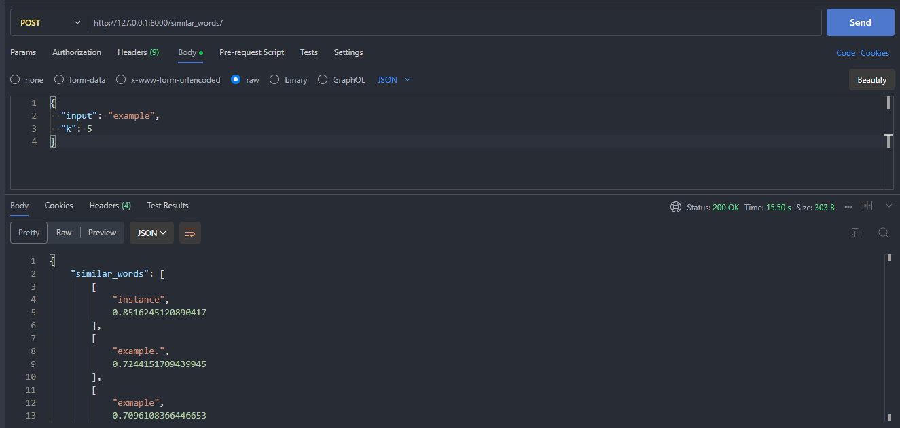
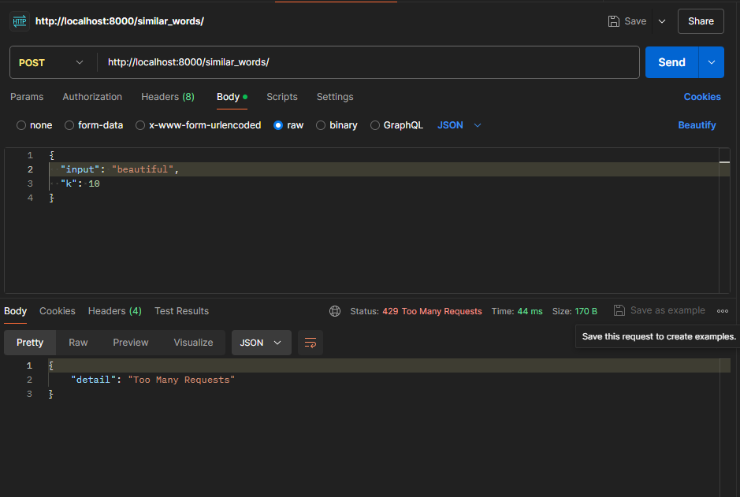

# FastAPI Word Similarity Finder

## Description

This project is a FastAPI application that finds similar words based on pre-trained word embeddings. It uses FastText embeddings and can either use a local file or download it from Firebase Storage if it doesn't exist locally.

## Why Use Firebase for FastText Embeddings?

FastText embedding files are typically large, often exceeding 2GB in size. Storing and managing such large files in a version control system like GitHub is impractical and unreliable due to size limitations and potential performance issues. Using Firebase Storage offers a more scalable and efficient solution.

## Why Redis?

Rate Limiting: Redis provides an efficient way to implement rate limiting, which is crucial for controlling the rate of requests to the FastAPI endpoints to prevent abuse and ensure fair usage.

### Setting Up Redis

1. Install Redis: Follow the instructions for your operating system from the official Redis installation guide. <https://redis.io/docs/latest/operate/oss_and_stack/install/install-redis/>

2. ```bash
    redis server
    redis cli
    ```

## Installation & Usage

1. Clone the repository:

   ```bash
   git clone https://github.com/yourusername/your-repo.git
   cd your-repo
   ```

2. Install the required packages:

   ```bash
   pip install -r requirements.txt
   ```

3. Add the `wiki-news-300d-1M.vec` file to the root directory of the project. If you prefer to use Firebase Storage, upload the file there and ensure the Firebase credentials are correctly set up as described below.

4. Environment Variables(If using firebase)

   ```plaintext
   FIREBASE_TYPE=
   FIREBASE_PROJECT_ID=
   FIREBASE_PRIVATE_KEY_ID=
   FIREBASE_PRIVATE_KEY=
   FIREBASE_CLIENT_EMAIL=
   FIREBASE_CLIENT_ID=
   FIREBASE_AUTH_URI=
   FIREBASE_TOKEN_URI=
   FIREBASE_AUTH_PROVIDER_X509_CERT_URL=
   FIREBASE_CLIENT_X509_CERT_URL=
   FIREBASE_UNIVERSE_DOMAIN=
   FIREBASE_STORAGE_BUCKET=
   ```

6. Run the FastAPI Server :

   ```bash
   python main.py
   ```

7. Use Postman(Extension on VS Code or Application) to send Post request to `http://127.0.0.1:8000/similar_words/` with the following json body:

   ```json
   {
     "input": "example",
     "k": 5
   }
   ```

### Example Response

   
   
